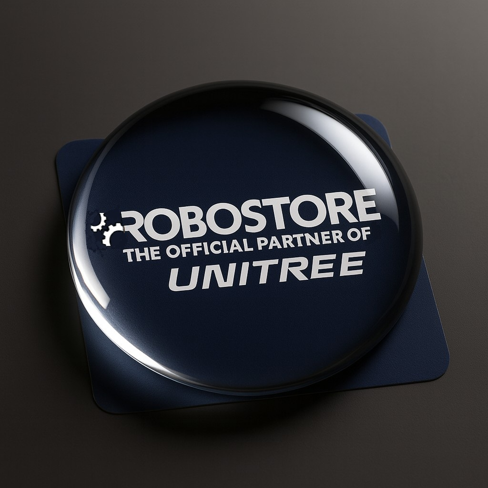

# RoboUniversity — Isaac Sim / Isaac Lab Course (Unitree G1, 23-DoF)




Welcome to the companion repository for the RoboUniversity course on **NVIDIA Isaac Sim** and **Isaac Lab**.  
This project shows a complete, reproducible RL workflow on a custom **Unitree G1 (23 DoF)** humanoid, including:
- clean extension packaging (`isaaclab_custom_ext`),
- simulation setup in Isaac Sim,
- task/env configs for Isaac Lab,
- optional robot sensors (RGB‑D camera, 3D LiDAR, IMU),
- training (RSL‑RL PPO) and play/testing entrypoints.

> **Target robot:** Unitree G1 (custom 23-DoF USD)  
> **Course host:** RoboUniversity (by RoboStore)  
> **Focus:** Sim → Train (Isaac Lab) → Play (Sim2Sim) → Sim2Real discussion

---

## ✨ What’s inside

- **Custom Isaac Lab extension** — `isaaclab_custom_ext`
  - Tasks/environments registered under Gym names:
    - `Ext-Isaac-Velocity-Flat-G1-v0` — base velocity tracking (migrated to extension).
    - `Ext-Isaac-Velocity-Flat-G1-Play-v0` — play mode for v0.
    - `Ext-Isaac-Velocity-Flat-G1-v1` — v0 + **sensors** (RGB‑D, LiDAR, IMU).
    - `Ext-Isaac-Velocity-Flat-G1-Play-v1` — play mode for v1.
  - Scripts:
    - `isaaclab_custom_ext.scripts.run_train_with_ext` — training launcher (isaaclab_custom_ext + RSL‑RL).
    - `isaaclab_custom_ext.scripts.run_play_with_ext` — play/rollout launcher.

- **Sensors on the robot** (v1 environments):
  1. **Front RGB‑D camera** (e.g., Intel RealSense **D435i**) — scene perception/depth.
  2. **Top 3D LiDAR (360°)** (e.g., **Livox Mid‑360**) — SLAM/obstacle avoidance.
  3. **IMU** — pose stabilization and orientation/velocity estimates.

---

## ✅ Prerequisites

- **Isaac Sim 5.x** (installed and licensed on your system).
- **Isaac Lab** cloned under your workspace (this repo expects sibling paths).
- **Conda env** with Python 3.10/3.11, CUDA-ready GPU drivers (NVIDIA).
- Git, CMake toolchain, etc., as required by Isaac Sim/Lab.

> When running with cameras, pass `--enable_cameras`.  
> On lower VRAM GPUs, prefer **headless** training and use reduced camera resolutions.

---

## 📦 Installation

1) Create a folder for your custom packages and clone the extension:
```bash
mkdir -p isaaclab_custom_ext
cd isaaclab_custom_ext
git clone https://github.com/execbat/isaaclab_custom_ext.git
```

2) Install the extension in **editable** mode into your Isaac‑Lab Conda env:
```bash
conda activate isaac5
cd isaaclab_custom_ext
pip install -e .
```

3) (Optional but recommended) Ensure Isaac Lab knows where to find your package:
- The launchers already do this internally via `ISAACLAB_TASKS_EXTRA_PACKAGES=isaaclab_custom_ext`.
- If you create new packages, add them to this variable (comma-separated).

---

## 🧱 Repository layout (core pieces)

```
isaaclab_custom_ext/
  ├─ isaaclab_custom_ext/
  │   ├─ registration/           # gym ids & isaaclab_custom_ext entry points
  │   ├─ custom_env_*/           # env/sensor/obs configs
  │   ├─ unitree_g1_23dof/       # G1 (23-DoF) asset config(s)
  │   ├─ scripts/
  │   │   ├─ run_train_with_ext.py
  │   │   └─ run_play_with_ext.py
  │   └─ ...
  └─ setup.py / pyproject.toml    # pip metadata
```

---

## 🎛️ Environments

- **Version 0 (no sensors):**
  - `Ext-Isaac-Velocity-Flat-G1-v0` — standard velocity-tracking task.
  - `Ext-Isaac-Velocity-Flat-G1-Play-v0` — play-mode for quick testing.

- **Version 1 (with sensors):**
  - `Ext-Isaac-Velocity-Flat-G1-v1` — **adds sensors** (RGB‑D, LiDAR, IMU).
  - `Ext-Isaac-Velocity-Flat-G1-Play-v1` — play-mode for sensor version.

> Height scanning (ray-caster terrain probe) is disabled by default in “flat” variants.  
> RGB‑D & LiDAR are optional; IMU attaches to a rigid link (with an offset if needed).

---

## 📷 Sensors — Notes

- **RGB‑D camera (D435i)**
  - Exposed via Isaac Lab `Camera` sensor (Replicator-backed).
  - Typical outputs: `rgb` and `distance_to_image_plane` (“depth”).  
  - Needs `--enable_cameras` for rendering.

- **3D LiDAR (Mid‑360)**
  - Implemented with **RayCaster** pattern for RL (fast, deterministic).  
  - For photoreal RTX LiDAR you can switch to the RTX sensor, but RayCaster is preferred for training speed.

- **IMU**
  - Must reference a **physical rigid body link** (e.g., `torso_link`).  
  - If your model has `imu_in_torso` Xform, place IMU on `torso_link` and use an **offset** equal to the local transform of `imu_in_torso`.

---

## 🚀 How to run

> Replace paths as needed for your workspace. From `IsaacLab/` root:

### Training — **Version 0 BASIC ENV**
```bash
./isaaclab.sh -p -m\
isaaclab_custom_ext.scripts.run_train_with_ext \
--task Ext-Isaac-Velocity-Flat-G1-v0 \
--num_envs 1 \
--headless
```

### Play/Testing — **Version 0**
```bash
./isaaclab.sh -p -m\
isaaclab_custom_ext.scripts.run_play_with_ext \
--task Ext-Isaac-Velocity-Flat-G1-Play-v0 \
--num_envs 1 \
--checkpoint ./logs/rsl_rl/custom_unitree_g1_flat/<experiment folder name (contains date-time)>/<model_name>.pt \
--rendering_mode performance
```


### Training — **Version 1 (with sensors and RayCaster LiDAR) SENSORS AND OBSERVATIONS**
```bash
./isaaclab.sh -p -m\
isaaclab_custom_ext.scripts.run_train_with_ext \
--task Ext-Isaac-Velocity-Flat-G1-v1 \
--num_envs 1 \
--enable_cameras \
--headless
```

### Play/Testing — **Version 1 (with sensors and RayCaster LiDAR)**
```bash
./isaaclab.sh -p -m\
isaaclab_custom_ext.scripts.run_play_with_ext \
--task Ext-Isaac-Velocity-Flat-G1-Play-v1 \
--num_envs 1 \
--enable_cameras \
--checkpoint ./logs/rsl_rl/custom_unitree_g1_flat/<experiment folder name (contains date-time)>/<model_name>.pt \
--rendering_mode performance
```


### Training — **Version 2 (with sensors and RTX LiDAR) ACTIONS AND CUSTOM COMMANDS**
```bash
./isaaclab.sh -p -m\
isaaclab_custom_ext.scripts.run_train_with_ext \
--task Ext-Isaac-Velocity-Flat-G1-v2 \
--num_envs 1 \
--enable_cameras \
--headless
```

### Play/Testing — **Version 2 (with sensors and RTX LiDAR)**
```bash
./isaaclab.sh -p -m\
isaaclab_custom_ext.scripts.run_play_with_ext \
--task Ext-Isaac-Velocity-Flat-G1-Play-v2 \
--num_envs 1 \
--enable_cameras \
--checkpoint ./logs/rsl_rl/custom_unitree_g1_flat/<experiment folder name (contains date-time)>/<model_name>.pt \
--rendering_mode performance
```


### Training — **Version 3 (with sensor and RTX LiDAR) REWARDS EVENTS TERMINATIONS**
```bash
./isaaclab.sh -p -m\
isaaclab_custom_ext.scripts.run_train_with_ext \
--task Ext-Isaac-Velocity-Flat-G1-v3 \
--num_envs 1 \
--enable_cameras \
--headless
```

### Play/Testing — **Version 3 (with sensors and RTX LiDAR)**
```bash
./isaaclab.sh -p -m\
isaaclab_custom_ext.scripts.run_play_with_ext \
--task Ext-Isaac-Velocity-Flat-G1-Play-v3 \
--num_envs 1 \
--enable_cameras \
--checkpoint ./logs/rsl_rl/custom_unitree_g1_flat/<experiment folder name (contains date-time)>/<model_name>.pt \
--rendering_mode performance
```


> **Tip:** Increase `--num_envs` when your GPU/CPU budget allows. Sensors, especially cameras, consume VRAM; tune resolutions and update periods accordingly.

---

## 🧠 Using sensor data in RL

- **LiDAR (RayCaster)** → flatten to a 1D vector (ranges/heights) → concatenate to vector observations.  
- **RGB** → feed to a **CNN/ResNet** encoder → get a feature vector → concatenate with vector observations.  
- **IMU** → linear acceleration, angular velocity, and orientation cues are exposed as standard vector observations.

In Isaac Lab, this is configured via **Observation Manager** terms (for what goes into observations) and the **Agent/Policy** config (for encoders and fusion of multiple observation groups).

---

## 🛠️ Troubleshooting

- **`omni.log` or kit modules not found** → ensure you launch via `./isaaclab.sh -p -m ...` so the Kit app (SimulationApp) bootstraps first.
- **RTX sensor / Replicator errors** → pass `--enable_cameras`. For low VRAM, reduce resolution and/or update period.
- **IMU init error (`RigidBodyAPI` not found)** → bind IMU to a physical link (e.g., `torso_link`) and set an offset rather than pointing to a pure `Xform`.
- **RayCaster fails on terrain** → make sure `mesh_prim_paths` points to your terrain prim (e.g., `/World/ground` from `TerrainImporterCfg`).

---

## 📣 Credits

- Built on **NVIDIA Isaac Sim** and **Isaac Lab**.
- Robot: **Unitree G1 (23-DoF)** — custom USD and configs.
- Course for **RoboUniversity** **RoboStore** designed by **Evgenii Dushkin** 
```
https://www.linkedin.com/in/evgenii-dushkin/
```

---

## 📜 License

This repository contains configs and glue code for educational purposes.  
Robot assets and third‑party components remain under their original licenses.
